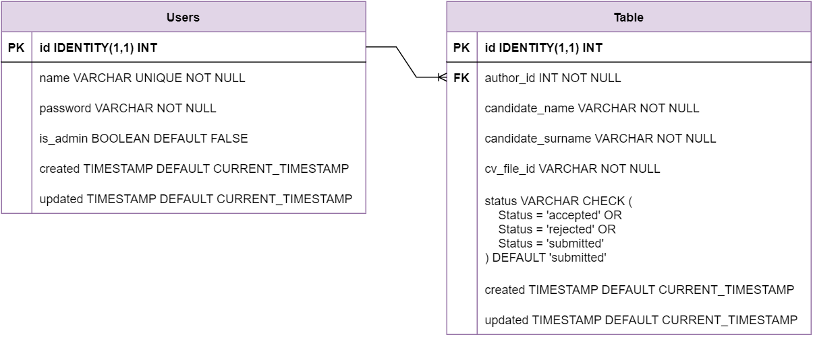

# cv-web-service
Status of last deployment:  

 

## Web service for referencing candidates  
The service expose a *RESTful API*
to send a candidate and its CV.  
**User** be able to see requests history and
their statuses (e.g. submitted, accepted, rejected).  
**Admin** be able to see all the
referenced candidates, filter them by the status and download the CV of a particular candidate.

# Database diagram

